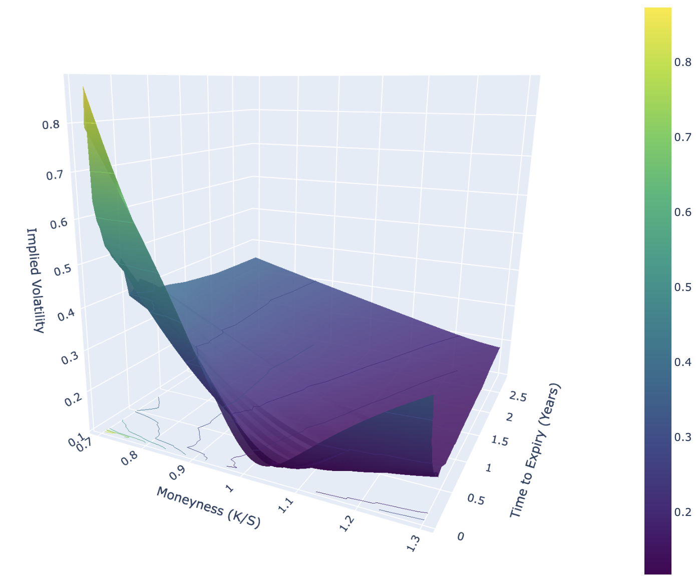

# Volatility Surface Modeling

The most famous equation in finance is almost undoubtedly that of the Black-Scholes model:

$\frac{\partial V}{\partial t} + \frac{1}{2}\sigma^2 S^2 \frac{\partial^2 V}{\partial S^2} + r S \frac{\partial V}{\partial S} - r V = 0$,

which when solved, leaves us with an explicit formula for the price of an option $V$ based on $S$ (the price of the underlying asset), $t$ (the time until the option's expiration), $r$ (the risk-free rate), and $\sigma$ (the asset's volatility).

However, despite this equation's status as a pillar of modern financial theory, there are some serious issues regarding the model's assumptions. One of these troublesome assumptions is that stock log-returns follow a log-normal distribution, implying that high loss events are statistically impossible.

In the real world, we've seen multiple occasions when this is not the case (1987, 2008, 2020). Because of this, traders bid up the price of certain options, past what the model suggests. In this project, we will approach this phenomenon through the lens of **implied volatility (IV)** and create a 3D visualization of strike price (we'll actually be using moneyness rather than strike price to "lock" the graph, explained later), time to maturity, and implied volatility. This modeling also allows us to value options that expire in times that don't have market data for that specific date.

IMPORTANT: If you're unable to view the visualizations in the notebook in GitHub, open the file in Google Colab, and the interactive visualizations should be accessible there.
